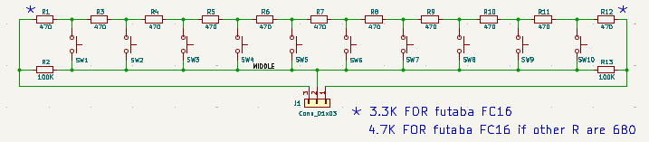

# SoundModule_Esp32_MycaMini
This new board is based on the [Teensy 4.0 sound card project](https://github.com/pierrotm777/SoundModule_Teensy4.0-version).  
The software behaves the same way, but the board is based on an ESP32 S3 Mini 8Mb PSRAM, which is 3 times cheaper than the Esp32 4.0 (around 15€).  
The board is also much smaller and will therefore fit more easily into small RC vehicles.  

## Credits
Based on a croby-b's code idea and powered by Rc-Navy libraries.  

## Outline of the documentation
1. Introduction (this page)
1. [Xany Compatibility](Xany_Compatibility.md)
1. [Xany Serial Commands](Full_SerialCmd.md)
1. [Buttons Serial Commands](Buttons_SerialCmd.md)
1. [USER Serial Commands](Users_Mode.md)
1. [Wiring Sound module](Wiring_Module.md)
1. [Sd Card Structure](SD_Card_Structure.md)

## Introduction
For build this module we use the [ESP32 S3 EspBoatAudio library by croby_b](https://github.com/pierrotm777/MyArduinoLibraries/tree/main/All_Other_Libs/EspBoatAudio).   

This Sound Module is primarily intended for model boats, trucks, tractors, tanks, and backhoe loaders, but can also be configured for aircraft.  

This module can:  
- vary the engine sound based on engine speed.  
- use any type of engine sound (more than 10 are already available).  
- 4 simultaneous sounds in addition to the engine sound.  
- 16 pre-programmable sounds.  
- 8 pre-programmable random sounds.  
- volume control by the touchscreen, a button on the transmitter, or two buttons on a 10-button keypad.  
- Smoke system management (tank + air pump).  
- 5 RGB LEDs (multicolored).  
- Controllable by touchscreen or 10-button keypad.  
- 3 new USER specific (PWM only) modes for the Myca Club of Cestas [📍 44.746233, -0.698128](https://www.google.com/maps?q=44.746233,-0.698128).   
- 3W audio I2S/amplifier MAX98357 (useful for small boats or testing).  
- Controllable by a receiver with PWM, CPPM, SBUS (Frsky or others), IBUS (Flysky), SRXL (Multiplex), SUMD (Graupner), JETI, or CRSF (ExpressLRS/TBS) output.  
- ESC output management to adjust engine sound (adjustable acceleration and deceleration).  
- 2 alarms, one of which is reversible to detect the absence of liquid, for example.  
- Telemetry feedback of the Esp32's temperature as well as the motor battery voltage for Frsky (Hub or S-Port), Flysky (Ibus), ExpressLRS/TBS (CRSF).  
- Module management/configuration by its serial interface.  
- Module configuration backup on an SD card.  

SD Card:  
- This contains all the sounds and the sound module's configuration.  

Power Supply:  
The module is powered by only a 5V 3A module.
It is possible to enable or disable the module's power supply using a relay or other solution via the On/Off connector.  

## ESP32 S3 8Mb PCB
A custom printed circuit board has been created. We are currently at version v1.0, visible above.   
.  

<table cellspacing=0>
  <tr>
    <td align=center width=400> <b>Top</td>
    <td align=center width=400> <b>Bottom</td>
  </tr>
</table>

## Three modes
Three modes are possibles:
- Use [X-Any/BURC encoder](https://p-loussouarn-free-fr.translate.goog/arduino/exemple/RCUL/RCUL.html?_x_tr_sch=http&_x_tr_sl=auto&_x_tr_tl=en&_x_tr_hl=en) fonctions by RC-Navy, thanks to him.  
- Use [Buttons Keypad](http://p.loussouarn.free.fr/projet/MS8-V2/MS8-V2.html#Keyboard) fonctions by RC-Navy, thanks to him.  
- USER mode.  
- The module read all WAV sounds from a SD card (from /ENGINES folder).  

You can find more informations on the Sound Module:
- [french manual](https://github.com/pierrotm777/https://github.com/pierrotm777/SoundModule_Esp32_MycaMini/blob/main/Module_Son_Manuel_Utilisateur.pdf).  
- [english manual (TODO)](https://github.com/pierrotm777/https://github.com/pierrotm777/SoundModule_Esp32_MycaMini/blob/main/Module_Son_Manuel_Utilisateur.pdf).    

### X-Any mode
This mode decode the X-Any/BURC stream.  

Depending on the receiver used, it's possible to connect the sound module in different ways:  
- PWM  (USER Only)  
- CPPM  
- SBUS (without inverter)  
- IBUS  
- SUMD  
- SRXL  
- JETIEX  
- CRSF  

A [BURC encoder](https://github.com/pierrotm777/BURC_Encoder) or a [LVGL ESP32 S3 Screen](https://github.com/pierrotm777/ESP32-BURC-Screen) is connected on a Handset by CPPM or SBUS.     

These X-Any/BURC coder use the **trainer port** as slave and use up to 2 channels (for the Sound Module) as X-Any fonctions.  
X-Any inject three additionals RC channels to a CPPM or SBUS frame for transport messages over these additionals channels.  
At reception side, these messages are extracted from these 2 channels corresponding to the additionals channels.  
These 2 channels are used to transport 2 messages containing the status of a set of switches or set of sound in the Sound Modul case.  

### Buttons mode
This mode use a keyboard with 10 buttons (8 buttons + 2 for volume sounds).  
It's a good solution for old rc transmitters that do not have a training input.  
This keyboard is connected on a free input channel in place of a potentiometer.  
This mode accept only 8 sounds.  
The buttons 9 and 10 up or down the volume's sounds.  

<table cellspacing=0>
  <tr>
    <td align=center width=400> <b>KeyBoard 10 buttons</td>
  </tr>
</table>

Depending on the receiver used, it's possible to connect the sound module in different ways:  
- PWM  
- CPPM  
- SBUS (without inverter)  
- IBUS  
- SUMD  
- SRXL  
- JETIEX  
- CRSF  

## WAV Sounds
Play **16-bit PCM 44100Hz Stereo** WAV audio samples at variable playback rates on Esp32.  
- Note : this library only works with signed 16-bit integer samples. Floating point samples will not play.  
- For best performance, use SDXC UHS 30MB/sec Application Performance Class 2 (A2) class micro SD-card.  

### Sounds Motor
It's possible to select several motors.  
Two sound motors systems are possibles:
  - CLASSIC:  
	The module can list all sound's motor found into the SD card [ENGINES Classic](/SD_ESP32/ENGINES).  
	**ENG.LIST = DSL-LTL, DSL-V12, VAPEUR, DSL-OLD, DSL-120, DSL-TURB, DSL-TUG, SCAN-V12, DSL-BIG, DSL-180, DIESEL7, SCAN-250, CAT-C32, BF109**  
	Each motor use:  
	- A start file, ex:DSL-LTL_STA.  
	- An idle file, ex:DSL-LTL_IDL.  
	- A stop file, ex:DSL-LTL_STP.  
  - BEIER:
	The module can list all sound's motor found into the SD card [ENGINES Beier format](/SD_ESP32/ENGINES/BEIER).  

Creating a new engine sound:  
Simply retrieve the desired engine sound to create a startup sound, an operating sound, and a shutdown sound.  
The more realistic the original sound, the more appealing the result will be.  
So, when the engine starts, you hear the typical sound of an engine hesitating, followed by the normal sound with variations in frequency and speed.  
Then, when the engine stick returns to center, after 5 to 10 seconds (adjustable), the shutdown sound is played.  
 
The better way, for me, is to use [Audacity](https://www.audacityteam.org) for cut all sound find and save it as 16bits PCM 44100Hz wav file.  

### All other sounds
All other other sounds will have to be copied under the main path.  
See our sounds [here](/SD_ESP32).  
You can change the **USER1.wav to USER16.wav by your own sounds**.  

## Upload a firmware
Only one firmware for all features:

## Wifi feature
This ESP32 version integrates an ESPNOW connection to communicate with the screen of the ESP32 programmer.   

## Temperatures feature
It's now possible to send telemetry to a RC transmitter.  
Three sensors are simulated:
  - Battery of your model, (by default 3S with R8=33K.  
  - Esp32 CPU temperature.  
  - Tank smoke temperature (need Attiny85 Smoke Engine board).  

  Versions telemetries usable are:
    - S-PORT (D16 Frsky)  
    - HUB (old D8 Frsky)  
    - IBUS   
    - MLINK  
    - HOTT  
    - JETIEX  
    - CRSF  
	

